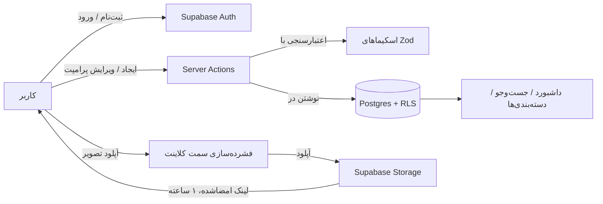

🇮🇷 فارسی | [🇬🇧 English](./README.md)

<div align="center" dir="rtl">

# 🧠 Prompt Saver

**یک کتابخانه‌ی مدرن و خصوصی برای ذخیره، سازمان‌دهی، جست‌وجو و استفاده‌ی مجدد از بهترین پرامپت‌های هوش مصنوعی شما.**

پرامپت‌ها · دسته‌بندی‌ها · تصاویر · جست‌وجوی کامل متن · حالت تیره

[](https://nextjs.org)
[](https://www.typescriptlang.org)
[](https://react.dev)
[](https://supabase.com)
[](https://tailwindcss.com)
[](https://vercel.com)
[](#-مجوز)

[معرفی](#-درباره‌ی-پروژه) • [قابلیت‌ها](#-قابلیت‌ها) • [معماری](#-ساختار-پروژه) • [راهنمای راه‌اندازی](#-راه‌اندازی-پروژه) • [امنیت](#-امنیت) • [سوالات متداول](#-سوالات-متداول)

</div>

---

<div dir="rtl">


## 📖 فهرست مطالب

- [درباره‌ی پروژه](#-درباره‌ی-پروژه)
- [قابلیت‌ها](#-قابلیت‌ها)
- [تکنولوژی‌های استفاده‌شده](#-تکنولوژی‌های-استفاده‌شده)
- [ساختار پروژه](#-ساختار-پروژه)
- [راه‌اندازی پروژه](#-راه‌اندازی-پروژه)
  - [پیش‌نیازها](#پیش‌نیازها)
  - [۱. کلون کردن ریپازیتوری](#۱-کلون-کردن-ریپازیتوری)
  - [۲. ساخت پروژه در Supabase](#۲-ساخت-پروژه-در-supabase)
  - [۳. اجرای مایگریشن‌های دیتابیس](#۳-اجرای-مایگریشن‌های-دیتابیس)
  - [۴. تنظیم متغیرهای محیطی](#۴-تنظیم-متغیرهای-محیطی)
  - [۵. اجرای پروژه به‌صورت محلی](#۵-اجرای-پروژه-به‌صورت-محلی)
  - [۶. دیپلوی روی Vercel](#۶-دیپلوی-روی-vercel)
- [تنظیمات ایمیل (اختیاری ولی پیشنهادی)](#-تنظیمات-ایمیل-اختیاری-ولی-پیشنهادی)
- [تست‌ها](#-تست‌ها)
- [امنیت](#-امنیت)
- [محدودیت‌های شناخته‌شده](#-محدودیت‌های-شناخته‌شده)
- [سوالات متداول](#-سوالات-متداول)
- [مشارکت در پروژه](#-مشارکت-در-پروژه)
- [مجوز](#-مجوز)

---

## 📌 درباره‌ی پروژه

**Prompt Saver** یک داشبورد خصوصی و اختصاصی برای هر کاربری است که مرتب با هوش مصنوعی کار می‌کند و از گم‌شدن بهترین پرامپت‌هایش در یادداشت‌های پراکنده، تاریخچه‌ی چت‌ها یا کاغذهای یادداشت خسته شده. این پروژه یک محل منظم و یکپارچه در اختیارتان می‌گذارد تا بتوانید:

- پرامپت‌ها را با عنوان، دسته‌بندی و توضیحات ذخیره کنید
- تا **۵ تصویر مرجع** به هر پرامپت پیوست کنید
- در کل کتابخانه‌تان فوراً جست‌وجو و فیلتر کنید
- همه‌چیز را کاملاً خصوصی و محدود به حساب کاربری خودتان نگه دارید

این پروژه برای **توسعه‌دهندگان، تولیدکنندگان محتوا، بازاریاب‌ها و کاربران حرفه‌ای هوش مصنوعی** ساخته شده که به دسترسی سریع‌تر و مطمئن‌تر به پرامپت‌هایی که واقعاً برایشان کار می‌کند نیاز دارند.

> [!NOTE]
> **وضعیت ساخت پروژه:** تمام کدهای این پروژه به‌طور کامل نوشته، تایپ‌چک، لینت و بیلد شده‌اند و منطق دیتابیس آن با تست‌های خودکار تأیید شده است. با این حال، این پروژه هنوز **به‌صورت end-to-end روی یک پروژه‌ی زنده‌ی Supabase توسط توسعه‌دهنده‌ی اصلی اجرا نشده است.** اولین اجرای واقعی خود پس از راه‌اندازی را به‌عنوان اولین تست یکپارچگی واقعی در نظر بگیرید و در صورت مشاهده‌ی هر مشکلی، لطفاً [یک ایشو باز کنید](https://github.com/imhamiddev/Prompt-saver/issues).

---

## ✨ قابلیت‌ها

| قابلیت | توضیح |
|---|---|
| 🔐 **کتابخانه‌ی خصوصی برای هر کاربر** | هر پرامپت، دسته‌بندی و تصویر کاملاً محدود به حساب شماست، از طریق Row Level Security در Supabase. |
| 🗂️ **دسته‌بندی‌ها** | پرامپت‌ها را در دسته‌بندی‌های دلخواه سازمان‌دهی کنید تا سریع‌تر پیدایشان کنید. |
| 🖼️ **پیوست تصویر** | تا ۵ تصویر به هر پرامپت پیوست کنید؛ تصاویر پیش از آپلود به‌صورت خودکار در سمت کلاینت فشرده می‌شوند. |
| 🔍 **جست‌وجوی کامل متن** | در تمام کتابخانه‌ی پرامپت‌هایتان فوراً جست‌وجو و فیلتر کنید. |
| 📄 **صفحه‌بندی (Pagination)** | حتی با کتابخانه‌های بزرگ، بدون افت عملکرد مرور کنید. |
| ✏️ **CRUD کامل** | ایجاد، ویرایش و حذف پرامپت‌ها و دسته‌بندی‌ها به‌سادگی. |
| 🌗 **تم روشن / تیره / سیستم** | مبتنی بر `next-themes`، تغییر فوری و ماندگار بین جلسات. |
| 🔒 **لینک‌های امضاشده برای تصاویر** | تصاویر به‌صورت پیش‌فرض خصوصی هستند؛ اپلیکیشن لینک‌های امضاشده‌ی کوتاه‌مدت (۱ ساعته) در سمت سرور تولید می‌کند. |
| 🚦 **محدودسازی نرخ درخواست (Rate Limiting)** | محدودسازی سبک درون‌حافظه‌ای روی لاگین/ثبت‌نام، به‌همراه محافظت داخلی خود Supabase Auth. |
| 📧 **قالب‌های ایمیل سفارشی** | قالب‌های HTML آماده و استایل‌دهی‌شده برای ایمیل‌های تأیید ثبت‌نام و بازیابی رمز عبور. |
| ⚡ **تکنولوژی مدرن** | App Router در Next.js 16، Server Actions، Turbopack و Server Components در React 19. |

---

## 🛠️ تکنولوژی‌های استفاده‌شده

- **[Next.js 16](https://nextjs.org/)** — App Router، Turbopack، Server Components + Server Actions
- **[React 19](https://react.dev/)**
- **[TypeScript](https://www.typescriptlang.org/)**
- **[Tailwind CSS v4](https://tailwindcss.com/)**
- **[shadcn/ui](https://ui.shadcn.com/)** (استایل new-york) + Radix primitives
- **[Supabase](https://supabase.com/)** — Postgres، Auth، Storage، Row Level Security
- **[Zod](https://zod.dev/)** + الگوهای React Hook Form برای اعتبارسنجی
- **[nextjs-toploader](https://www.npmjs.com/package/nextjs-toploader)** برای نوار پیشرفت بالای صفحه هنگام تغییر مسیر
- **[next-themes](https://github.com/pacocoursey/next-themes)** برای تغییر تم
- **[browser-image-compression](https://www.npmjs.com/package/browser-image-compression)** برای بهینه‌سازی تصاویر در سمت کلاینت
- **[Vitest](https://vitest.dev/)** برای تست‌های واحد (Unit Test)

---

## 📁 ساختار پروژه

### جریان درخواست‌ها



### چیدمان پوشه‌ها

```text
app/
  (public)/              → لندینگ، ورود، ثبت‌نام (مسیرهای بدون نیاز به احراز هویت)
  (app)/                 → داشبورد، prompts/new، prompts/[id]، prompts/[id]/edit
                            (محافظت‌شده — به proxy.ts نگاه کنید)
actions/                 → Server Actions (ایجاد/به‌روزرسانی/حذف برای احراز هویت،
                            دسته‌بندی‌ها، پرامپت‌ها، تصاویر)
lib/
  supabase/               → کلاینت مرورگر، کلاینت سرور، میدل‌ور سشن
  validations/            → اسکیماهای Zod (منبع واحد اعتبارسنجی هم در
                            سمت کلاینت و هم در سمت سرور)
  queries/                → دسترسی به داده فقط برای خواندن (فقط سمت سرور)
  rate-limit.ts           → محدودکننده‌ی سبک نرخ درخواست، درون‌حافظه‌ای
components/
  ui/                     → کامپوننت‌های shadcn/ui
  prompts/, categories/, auth/  → کامپوننت‌های مربوط به هر قابلیت
types/database.types.ts  → تایپ‌های دستی هماهنگ با مایگریشن‌ها
                            (پس از اتصال، با Supabase CLI بازتولید کنید)
proxy.ts                  → روش میدل‌ور در Next.js 16: نوسازی سشن
                            Supabase و محافظت از مسیرها
supabase/
  migrations/              → فایل‌های SQL مایگریشن (روی پروژه‌ی خودتان اجرا کنید)
  test/                     → مجموعه تست SQL محلی (بخشی از اپلیکیشن نیست)
```

---

## 🚀 راه‌اندازی پروژه

مراحل زیر را به‌ترتیب دنبال کنید تا پروژه از صفر به‌صورت کامل روی سیستم شما اجرا شود.

### پیش‌نیازها

| پیش‌نیاز | توضیح |
|---|---|
| **[Node.js](https://nodejs.org/)** نسخه‌ی ۱۸.۱۸ یا بالاتر | برای اجرا و بیلد پروژه لازم است |
| **[npm](https://www.npmjs.com/)** | همراه با Node.js نصب می‌شود |
| یک حساب رایگان در **[Supabase](https://supabase.com/)** | Postgres، Auth و Storage همه در یک‌جا |
| یک حساب رایگان در **[Vercel](https://vercel.com/)** | اختیاری — فقط برای دیپلوی لازم است |
| یک حساب رایگان در **[Resend](https://resend.com/)** | اختیاری — فقط برای قالب‌های ایمیل سفارشی لازم است |

---

### ۱. کلون کردن ریپازیتوری

```bash
git clone https://github.com/imhamiddev/Prompt-saver.git
cd Prompt-saver
```

---

### ۲. ساخت پروژه در Supabase

۱. به [supabase.com](https://supabase.com) بروید و یک پروژه‌ی جدید بسازید (هر ریجن نزدیک به خودتان را انتخاب کنید).
۲. صبر کنید تا فرآیند راه‌اندازی تمام شود، سپس **Project Settings → API** را باز کنید. دو مقدار زیر را از این‌جا نیاز خواهید داشت:
   - **Project URL**
   - **anon public key**
۳. *(اختیاری)* مقدار **service_role key** را نیز از همین صفحه یادداشت کنید — اما **هرگز** آن را در متغیرهای `NEXT_PUBLIC_*` یا کد سمت کلاینت قرار ندهید. این اپلیکیشن در حالت عادی به آن نیازی ندارد.

---

### ۳. اجرای مایگریشن‌های دیتابیس

فایل‌های SQL موجود در `supabase/migrations/` تمام جدول‌ها، ایندکس‌ها، تریگرها، سیاست‌های RLS و باکت/سیاست‌های Storage موردنیاز اپلیکیشن را می‌سازند، **دقیقاً به این ترتیب**:

| فایل | چه چیزی می‌سازد |
|---|---|
| `20260916234100_helper_functions.sql` | تابع تریگر مشترک `updated_at` |
| `20260916234200_categories.sql` | جدول `categories` + RLS |
| `20260916234300_prompts.sql` | جدول `prompts`، جست‌وجوی کامل متن، تریگر مالکیت دسته‌بندی، RLS |
| `20260916234400_prompt_images.sql` | جدول `prompt_images`، تریگر محدودیت ۵ تصویر، RLS |
| `20260916234500_storage.sql` | باکت Storage با نام `prompt-images` + سیاست‌های Storage مبتنی بر مالکیت |

#### ✅ گزینه‌ی الف — استفاده از Supabase CLI (پیشنهادی)

```bash
npm install -g supabase
supabase login
supabase link --project-ref <your-project-ref>   # این مقدار را در URL یا تنظیمات پروژه‌تان پیدا کنید
supabase db push
```

این دستور همه‌ی فایل‌های داخل `supabase/migrations/` را به‌ترتیب و به‌صورت خودکار اجرا می‌کند.

#### 🖱️ گزینه‌ی ب — استفاده از SQL Editor (دستی)

اگر تمایلی به نصب CLI ندارید، بخش **SQL Editor** را در داشبورد Supabase باز کنید و محتوای هر فایل را **دقیقاً به ترتیب گفته‌شده در بالا** اجرا کنید — توابع تریگر و جدول `categories` باید پیش از ساخته‌شدن `prompts` وجود داشته باشند و به همین ترتیب برای بقیه‌ی فایل‌ها.

#### 🔄 پس از اجرای مایگریشن‌ها: بازتولید تایپ‌ها (پیشنهادی)

فایل `types/database.types.ts` به‌صورت دستی و کاملاً منطبق با این مایگریشن‌ها نوشته شده است. پس از اتصال پروژه‌تان، می‌توانید آن را مستقیماً از روی اسکیمای زنده بازتولید کنید تا هیچ‌وقت دچار ناهماهنگی نشود:

```bash
npx supabase gen types typescript --project-id <your-project-ref> > types/database.types.ts
```

#### 🔁 ضروری: مجاز کردن آدرس بازگشتی احراز هویت (Auth Callback URL)

فرآیند بازیابی رمز عبور (و به‌طور کلی هر لینک ایمیلی که Supabase ارسال می‌کند) در این اپلیکیشن به مسیر `/auth/confirm` بازمی‌گردد. Supabase به‌طور پیش‌فرض بازگشت به آدرس‌های ناشناخته را مسدود می‌کند، پس **حتماً** باید این مسیر را مجاز کنید:

۱. در داشبورد Supabase، به بخش **Authentication → URL Configuration** بروید.
۲. زیر بخش **Redirect URLs**، موارد زیر را اضافه کنید:
   - `http://localhost:3000/auth/confirm` — برای توسعه‌ی محلی
   - `https://your-app.vercel.app/auth/confirm` — پس از دیپلوی (به [بخش ۶](#۶-دیپلوی-روی-vercel) مراجعه کنید)

> ⚠️ بدون انجام این مرحله، کلیک روی لینک بازیابی رمز عبور یا تأیید ثبت‌نام، به‌جای رسیدن به اپلیکیشن، با خطایی از سمت Supabase مواجه می‌شود.

---

### ۴. تنظیم متغیرهای محیطی

فایل نمونه را کپی کنید:

```bash
cp .env.example .env.local
```

سپس مقادیر به‌دست‌آمده از مرحله‌ی ۲ را در آن قرار دهید:

```env
NEXT_PUBLIC_SUPABASE_URL=https://xxxxx.supabase.co
NEXT_PUBLIC_SUPABASE_ANON_KEY=eyJ...
SUPABASE_SERVICE_ROLE_KEY=           # اختیاری، مگر این‌که واقعاً نیاز داشته باشید خالی بگذارید
```

<details>
<summary><strong>برای مشاهده‌ی فهرست کامل متغیرها کلیک کنید</strong></summary>

<br>

| متغیر | منبع | الزامی؟ |
|---|---|---|
| `NEXT_PUBLIC_SUPABASE_URL` | Supabase → Project Settings → API | ✅ بله |
| `NEXT_PUBLIC_SUPABASE_ANON_KEY` | Supabase → Project Settings → API | ✅ بله |
| `SUPABASE_SERVICE_ROLE_KEY` | Supabase → Project Settings → API | ⛔ اختیاری |

</details>

> 💡 مقدار **anon key** نمایش دادنش در مرورگر مشکلی ندارد — چون تمام جدول‌ها دارای Row Level Security فعال هستند و کنترل دسترسی توسط خود Postgres اعمال می‌شود. اما **service role key** کاملاً متفاوت است: این کلید کل RLS را دور می‌زند و **هرگز** نباید در مرورگر نمایش داده شود یا در ریپازیتوری کامیت شود.

---

### ۵. اجرای پروژه به‌صورت محلی

```bash
npm install
npm run dev
```

آدرس **[http://localhost:3000](http://localhost:3000)** را باز کنید. باید بتوانید:

- ✅ یک حساب کاربری جدید ثبت کنید
- ✅ وارد شوید
- ✅ یک پرامپت بسازید
- ✅ تصویر پیوست کنید
- ✅ جست‌وجو، فیلتر و صفحه‌بندی کنید
- ✅ پرامپت‌ها را ویرایش و حذف کنید

... همه‌چیز به‌صورت زنده و متصل به پروژه‌ی Supabase خودتان.

---

### ۶. دیپلوی روی Vercel

۱. این ریپازیتوری را روی گیت‌هاب (یا گیت‌لب/بیت‌باکت) پوش کنید.
۲. در [Vercel](https://vercel.com)، روی **New Project** کلیک کنید و ریپازیتوری را ایمپورت کنید.
۳. زیر بخش **Environment Variables**، همان سه متغیر فایل `.env.local` را اضافه کنید.
۴. روی **Deploy** کلیک کنید — Vercel به‌طور خودکار Next.js را تشخیص می‌دهد و دستور بیلد صحیح (`next build`) را اجرا می‌کند.
۵. پس از دیپلوی، به بخش **Authentication → URL Configuration** در پروژه‌ی Supabase خود برگردید و آدرس Vercel خود (مثلاً `https://your-app.vercel.app`) را هم به **Site URL** و هم به **Redirect URLs** اضافه کنید تا فرآیندهای احراز هویت در محیط پروداکشن به‌درستی کار کنند.

#### 🔤 اختیاری: بازگرداندن فونت‌های گوگل

در حین توسعه‌ی اولیه، به‌دلیل نبود دسترسی شبکه به `fonts.googleapis.com` در محیط ساخت (sandbox)، فونت `next/font/google` (به نام Geist) با فونت‌های پیش‌فرض سیستم جایگزین شد. محیط بیلد Vercel دسترسی عادی به اینترنت دارد، پس اگر مایلید فونت اصلی Geist را برگردانید، این خط را در `app/layout.tsx` دوباره اضافه کنید:

```ts
import { Geist, Geist_Mono } from "next/font/google";
```

این تغییر کاملاً ظاهری است و هیچ تأثیری روی عملکرد ندارد.

---

## 📧 تنظیمات ایمیل (اختیاری ولی پیشنهادی)

### تأیید ایمیل (مبتنی بر لینک)

به‌صورت پیش‌فرض، هنگام ثبت‌نام یک کاربر، Supabase یک لینک تأیید برایش ایمیل می‌کند. کاربر روی آن کلیک می‌کند، تأیید می‌شود و به `/dashboard` هدایت می‌شود. **هیچ تنظیم اضافه‌ای برای کارکرد این بخش لازم نیست** — این رفتار پیش‌فرض است.

### زمان انقضای لینک

لینک تأیید ثبت‌نام و لینک بازیابی رمز عبور، هر دو یک تنظیم مشترک دارند: **Authentication → Sign In / Providers → Email → Email OTP Expiration** (بر حسب ثانیه؛ پیش‌فرض `3600` یعنی ۱ ساعت). **بازه‌ی ۱۵ تا ۳۰ دقیقه انتخاب معقولی است** — زمان انقضای بسیار کوتاه می‌تواند باعث شود کلیک‌های واقعی کاربر هم به‌دلیل "پیش‌بارگذاری" لینک توسط اسکنرهای امنیتی ایمیل، با شکست مواجه شود.

### استفاده از قالب‌های ایمیل زیباتر (اختیاری)

قالب‌های پیش‌فرض ایمیل در Supabase ساده و بدون استایل هستند. این ریپازیتوری شامل قالب‌های HTML طراحی‌شده و سازگار با کلاینت‌های ایمیل است:

- `supabase/email-templates/confirm-signup.html` → در بخش **Authentication → Emails → Confirm signup** جایگذاری کنید
- `supabase/email-templates/reset-password.html` → در بخش **Authentication → Emails → Reset password** جایگذاری کنید

> ⚠️ **از ژوئن ۲۰۲۶ به بعد**، پروژه‌های Supabase در پلن رایگان که از سرویس ایمیل پیش‌فرض استفاده می‌کنند، دیگر نمی‌توانند این قالب‌ها را مستقیماً ویرایش کنند — فیلدها فقط‌خواندنی هستند مگر این‌که یک SMTP سفارشی تنظیم کنید یا به پلن پولی ارتقا دهید. پروژه‌هایی که پیش از **۳ ژوئن ۲۰۲۶** ساخته شده‌اند، همچنان دسترسی کامل ویرایش را دارند.

برای فعال‌سازی ویرایش قالب‌ها با یک SMTP سفارشی رایگان از طریق **[Resend](https://resend.com)** (روزانه ۳٬۰۰۰ ایمیل رایگان):

۱. یک حساب Resend بسازید و یک API Key تولید کنید (**داشبورد Resend → API Keys**).
۲. در Supabase: **Authentication → Emails → SMTP Settings**، گزینه‌ی **Custom SMTP** را فعال کنید و موارد زیر را پر کنید:

   | فیلد | مقدار |
   |---|---|
   | Host | `smtp.resend.com` |
   | Port | `465` |
   | Username | `resend` |
   | Password | همان API Key گرفته‌شده از Resend |
   | Sender email / name | هر چیزی که دوست دارید کاربران ببینند |

۳. ذخیره کنید — اکنون فیلدهای قالب باید قابل‌ویرایش باشند. فایل‌های HTML بالا را در آن‌ها جایگذاری کنید.

> اگر اصلاً تمایلی به راه‌اندازی SMTP ندارید، اشکالی ندارد — اپلیکیشن همچنان به‌درستی کار می‌کند؛ فقط با طراحی ساده‌ی پیش‌فرض Supabase (و در پلن رایگان، محدودیت ۲ تا ۳ ایمیل در ساعت) مواجه خواهید بود تا زمانی که آن را تنظیم کنید.

### چرا لینک بازیابی رمز عبور غیرمعمول به‌نظر می‌رسد

لینک داخل `reset-password.html` به‌جای اشاره‌ی مستقیم به `/auth/confirm`، به مسیر `/reset-password/start#confirm_url=...` اشاره می‌کند. این کار **عمدی** است — و از این جلوگیری می‌کند که اسکنرهای امنیتی ایمیل به‌صورت خاموش لینک را "پیش‌بارگذاری" کرده و توکن یک‌بارمصرف بازیابی را پیش از کلیک واقعی کاربر مصرف کنند. **این لینک را به فرم مستقیم برنگردانید** — چراکه دوباره همان مشکل را ایجاد خواهد کرد.

---

## 🧪 تست‌ها

در طول توسعه، دو لایه‌ی مستقل تست انجام شده است:

**۱. تست‌های عملکردی SQL** (`supabase/test/`) — یک مجموعه‌ی تست محلی که بخش‌هایی از اسکیمای پلتفرم Supabase را شبیه‌سازی می‌کند تا مایگریشن‌های واقعی روی یک نمونه‌ی واقعی از PostgreSQL قابل‌اجرا و آزمایش باشند. **این بخش جزئی از اپلیکیشن نیست** — می‌توانید این پوشه را بدون نگرانی نادیده بگیرید یا حذف کنید.

**۲. تست‌های واحد (Vitest)** — اسکیماهای اعتبارسنجی و منطق میدل‌ور احراز هویت/محافظت از مسیر را پوشش می‌دهند.

**۳. بررسی‌های استاتیک** — همیشه باید بدون خطا اجرا شوند.

| دستور | توضیح |
|---|---|
| `npx vitest run` | اجرای مجموعه تست‌های واحد |
| `npx tsc --noEmit` | بررسی تایپ کل پروژه |
| `npx eslint .` | لینت کد |
| `npm run build` | بیلد نسخه‌ی پروداکشن |

---

## 🔒 امنیت

- **Row Level Security (RLS)** مکانیزم اصلی کنترل دسترسی است — تمام جدول‌ها (`categories`، `prompts`، `prompt_images`) دارای RLS فعال و اجباری هستند و بر اساس `auth.uid()` محدود می‌شوند.
- **مالکیت بین‌جدولی** (مثلاً این‌که دسته‌بندی یک پرامپت باید متعلق به همان کاربر باشد) توسط تریگرهای دیتابیس اعمال می‌شود.
- **محدودیت ۵ تصویر در هر پرامپت** در سه لایه اعمال می‌شود: رابط کاربری آپلود، Server Action و یک تریگر دیتابیس به‌عنوان لایه‌ی نهایی.
- **تصاویر خصوصی هستند** — باکت Storage عمومی نیست؛ لینک‌های امضاشده‌ی کوتاه‌مدت (۱ ساعته) در سمت سرور تولید می‌شوند و سیاست‌های RLS سطح Storage دسترسی را به پوشه‌ی خود هر کاربر محدود می‌کند.
- **فشرده‌سازی تصویر در سمت کلاینت** حجم تصاویر بزرگ را پیش از آپلود کاهش می‌دهد؛ اما محدودیت‌های واقعی حجم فایل و نوع MIME در سمت سرور (روی باکت) صرف‌نظر از رفتار کلاینت، همچنان اعمال می‌شوند.
- **پیام‌های خطای عمومی** به کاربران نمایش داده می‌شود؛ جزئیات واقعی خطا فقط در سمت سرور لاگ می‌شوند.
- **محدودسازی نرخ درخواست** روی لاگین/ثبت‌نام، در کنار محافظت داخلی خود Supabase Auth (درون‌حافظه‌ای و به‌ازای هر نمونه — برای تضمین سخت‌گیرانه‌تر، آن را با Upstash Redis جایگزین کنید).
- **هدرهای امنیتی** (`X-Frame-Options`، `X-Content-Type-Options`، `Referrer-Policy`، `Permissions-Policy`) در `next.config.ts` تنظیم شده‌اند.
- **هرگز `.env.local` را کامیت نکنید** — فقط `.env.example` (با مقادیر خالی) در گیت ردیابی می‌شود.

---

## ⚠️ محدودیت‌های شناخته‌شده

- این پروژه بدون اتصال زنده به Supabase ساخته و تست شده است — اولین اجرای واقعی خود را به‌عنوان اولین تست یکپارچگی در نظر بگیرید.
- فرآیند بازیابی رمز عبور **نیازمند** انجام مرحله‌ی تنظیم آدرس بازگشتی در [بخش ۳](#۳-اجرای-مایگریشن‌های-دیتابیس) است.
- محدودکننده‌ی نرخ درخواست درون‌حافظه‌ای و مختص هر نمونه است (بین نمونه‌های سرورلس مشترک نیست).
- حذف دسته‌بندی در صورت داشتن پرامپت مسدود می‌شود — هنوز رابط کاربری برای انتقال دسته‌ای پرامپت‌ها به دسته‌بندی دیگر وجود ندارد.
- هنوز **رابط کاربری** مرتب‌سازی مجدد تصاویر پیاده‌سازی نشده (هرچند Server Action و پشتیبانی دیتابیس آن از قبل آماده است).
- ماندگاری تم بین بارگذاری‌های مجدد به `localStorage` مرورگر وابسته است و در طول توسعه در یک مرورگر واقعی آزمایش نشده — بعد از دیپلوی یک بررسی دستی سریع توصیه می‌شود.

---

## ❓ سوالات متداول

**چرا anon key توی `.env.example` کامیت می‌شه ولی service role key خالی می‌مونه؟**

چون این دو کاربرد کاملاً متفاوتی دارند. anon key از ابتدا برای عمومی‌بودن طراحی شده — چیزی است که مرورگر استفاده می‌کند، و این Row Level Security در Postgres است که واقعاً جلوی دسترسی غیرمجاز را می‌گیرد. اما service role key کل RLS را دور می‌زند، پس هرگز نباید جایی نمایش داده شود یا در کد هاردکد شود.

**اصلاً به service role key نیاز دارم؟**

نه. عملکرد عادی اپلیکیشن — ثبت‌نام، ورود، ساخت پرامپت، آپلود تصویر — هیچ‌وقت به آن نیاز ندارد. این کلید فقط برای اسکریپت‌های مدیریتی اختیاری سمت سرور است که ممکن است خودتان بنویسید.

**چرا لینک بازیابی رمز عبور این‌قدر با یک لینک معمولی Supabase فرق دارد؟**

این کاملاً عمدی است — به بخش [چرا لینک بازیابی رمز عبور غیرمعمول به‌نظر می‌رسد](#چرا-لینک-بازیابی-رمز-عبور-غیرمعمول-بهنظر-میرسد) مراجعه کنید. این طراحی از مصرف‌شدن خاموش توکن یک‌بارمصرف توسط اسکنرهای امنیتی ایمیل، پیش از کلیک واقعی کاربر، جلوگیری می‌کند.

**می‌توانم بدون تنظیم SMTP سفارشی از پروژه استفاده کنم؟**

بله. اپلیکیشن به‌طور کامل با سرویس ایمیل پیش‌فرض Supabase کار می‌کند — فقط ایمیل‌هایی ساده و بدون استایل و محدودیت ارسال ساعتی کمتر (در پلن رایگان) خواهید داشت.

---

## 🤝 مشارکت در پروژه

مشارکت، گزارش باگ و پیشنهاد قابلیت جدید همیشه خوش‌آمد است!
می‌توانید سری به [صفحه‌ی ایشوها](https://github.com/imhamiddev/Prompt-saver/issues) بزنید یا یک Pull Request باز کنید.

۱. پروژه را Fork کنید
۲. یک برنچ برای قابلیت جدید بسازید (`git checkout -b feature/amazing-feature`)
۳. تغییرات خود را کامیت کنید (`git commit -m 'Add some amazing feature'`)
۴. برنچ را پوش کنید (`git push origin feature/amazing-feature`)
۵. یک Pull Request باز کنید

---

## 📄 مجوز

[](https://opensource.org/licenses/MIT)

این پروژه تحت مجوز **MIT** منتشر شده است — یعنی آزادید از آن استفاده کنید، کپی بگیرید، تغییرش دهید، ادغام کنید، منتشر کنید، توزیع کنید و حتی بفروشید، فقط کافی‌ست اعلان کپی‌رایت اصلی را در آن نگه دارید. برای متن کامل به فایل [`LICENSE`](./LICENSE) مراجعه کنید.

---

<div align="center">

ساخته‌شده با ❤️ توسط [imhamiddev](https://github.com/imhamiddev)

</div>

</div>
