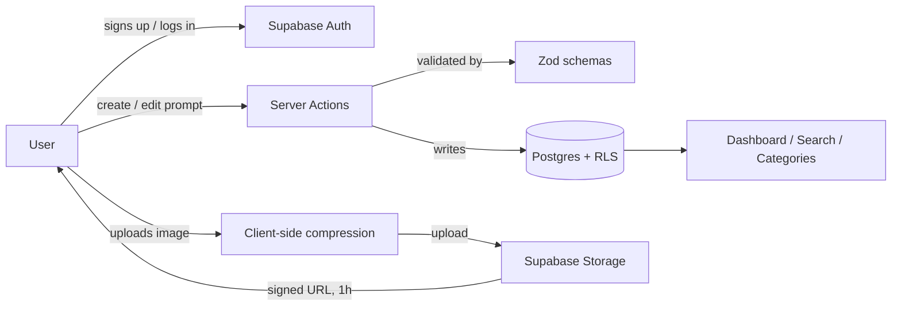

[🇮🇷 فارسی](./README.fa.md) | 🇬🇧 English

<div align="center">

# 🧠 Prompt Saver

**A modern, private library for saving, organizing, searching, and reusing your best AI prompts.**

Prompts · Categories · Images · Full-text search · Dark mode

[](https://nextjs.org)
[](https://www.typescriptlang.org)
[](https://react.dev)
[](https://supabase.com)
[](https://tailwindcss.com)
[](https://vercel.com)
[](#-license)

[Overview](#-about-the-project) • [Features](#-features) • [Architecture](#-project-structure) • [Setup Guide](#-getting-started) • [Security](#-security) • [FAQ](#-faq)

</div>

---

## 📖 Table of Contents

- [About the Project](#-about-the-project)
- [Features](#-features)
- [Tech Stack](#-tech-stack)
- [Project Structure](#-project-structure)
- [Getting Started](#-getting-started)
  - [Prerequisites](#prerequisites)
  - [1. Clone the Repository](#1-clone-the-repository)
  - [2. Create a Supabase Project](#2-create-a-supabase-project)
  - [3. Run the Database Migrations](#3-run-the-database-migrations)
  - [4. Configure Environment Variables](#4-configure-environment-variables)
  - [5. Run Locally](#5-run-locally)
  - [6. Deploy to Vercel](#6-deploy-to-vercel)
- [Email Setup (Optional but Recommended)](#-email-setup-optional-but-recommended)
- [Testing](#-testing)
- [Security](#-security)
- [Known Limitations](#-known-limitations)
- [FAQ](#-faq)
- [Contributing](#-contributing)
- [License](#-license)

---

## 📌 About the Project

**Prompt Saver** is a private, per-user dashboard for anyone who works with AI regularly and is tired of losing their best prompts in scattered notes, chat histories, or sticky notes. It gives you one organized place to:

- Save prompts with titles, categories, and descriptions
- Attach up to **5 reference images** per prompt
- Search and filter your entire library instantly
- Keep everything private and scoped only to your own account

It's built for **developers, creators, marketers, and everyday AI power-users** who want faster, more reliable access to the prompts that actually work for them.

> [!NOTE]
> **Build status:** This project has been fully written, type-checked, linted, and built successfully, and its database logic has been verified with automated tests. However, it has **not yet been run end-to-end against a live Supabase project** by its original developer. Treat your first real run after setup as the first live integration test, and please [open an issue](https://github.com/imhamiddev/Prompt-saver/issues) if anything doesn't behave as expected.

---

## ✨ Features

| Feature | Description |
|---|---|
| 🔐 **Private per-user library** | Every prompt, category, and image is scoped strictly to your account via Supabase Row Level Security. |
| 🗂️ **Categories** | Organize prompts into custom categories for quick retrieval. |
| 🖼️ **Image attachments** | Attach up to 5 images per prompt, automatically compressed client-side before upload. |
| 🔍 **Full-text search** | Instantly search and filter across your prompt library. |
| 📄 **Pagination** | Browse large libraries without performance issues. |
| ✏️ **Full CRUD** | Create, edit, and delete prompts and categories with ease. |
| 🌗 **Light / Dark / System theme** | Powered by `next-themes`, switches instantly and persists across sessions. |
| 🔒 **Signed image URLs** | Images are private by default; the app generates short-lived (1-hour) signed URLs server-side. |
| 🚦 **Rate limiting** | Lightweight in-memory rate limiting on login/register, layered on top of Supabase Auth's own protection. |
| 📧 **Custom email templates** | Ready-made, styled HTML templates for signup confirmation and password reset emails. |
| ⚡ **Modern stack** | Next.js 16 App Router, Server Actions, Turbopack, and React 19 Server Components. |

---

## 🛠️ Tech Stack

- **[Next.js 16](https://nextjs.org/)** — App Router, Turbopack, Server Components + Server Actions
- **[React 19](https://react.dev/)**
- **[TypeScript](https://www.typescriptlang.org/)**
- **[Tailwind CSS v4](https://tailwindcss.com/)**
- **[shadcn/ui](https://ui.shadcn.com/)** (new-york style) + Radix primitives
- **[Supabase](https://supabase.com/)** — Postgres, Auth, Storage, Row Level Security
- **[Zod](https://zod.dev/)** + React Hook Form conventions for validation
- **[nextjs-toploader](https://www.npmjs.com/package/nextjs-toploader)** for route-change progress
- **[next-themes](https://github.com/pacocoursey/next-themes)** for theme switching
- **[browser-image-compression](https://www.npmjs.com/package/browser-image-compression)** for client-side image optimization
- **[Vitest](https://vitest.dev/)** for unit testing

---

## 📁 Project Structure

### Request flow



### Folder layout

```text
app/
  (public)/              → landing, login, register (unauthenticated routes)
  (app)/                 → dashboard, prompts/new, prompts/[id], prompts/[id]/edit
                            (protected — see proxy.ts)
actions/                 → Server Actions (create/update/delete for auth,
                            categories, prompts, images)
lib/
  supabase/               → browser client, server client, session middleware
  validations/            → Zod schemas (single source of truth for both
                            client-side and server-side validation)
  queries/                → read-only data access (server-only)
  rate-limit.ts           → lightweight in-memory rate limiter
components/
  ui/                     → shadcn/ui components
  prompts/, categories/, auth/  → feature components
types/database.types.ts  → hand-written types matching the migrations
                            (regenerate with the Supabase CLI once linked)
proxy.ts                  → Next.js 16 middleware convention: refreshes
                            the Supabase session and protects routes
supabase/
  migrations/              → SQL migrations (run these against your project)
  test/                     → local-only SQL test harness (not part of the app)
```

---

## 🚀 Getting Started

Follow these steps in order — from zero to a fully running local instance.

### Prerequisites

| Requirement | Notes |
|---|---|
| **[Node.js](https://nodejs.org/)** 18.18+ | Required to run and build the app |
| **[npm](https://www.npmjs.com/)** | Comes bundled with Node.js |
| A free **[Supabase](https://supabase.com/)** account | Postgres, Auth, and Storage all in one |
| A free **[Vercel](https://vercel.com/)** account | Optional — only needed for deployment |
| A free **[Resend](https://resend.com/)** account | Optional — only needed for custom email templates |

---

### 1. Clone the Repository

```bash
git clone https://github.com/imhamiddev/Prompt-saver.git
cd Prompt-saver
```

---

### 2. Create a Supabase Project

1. Go to [supabase.com](https://supabase.com) and create a new project (pick any region close to you).
2. Wait for provisioning to finish, then open **Project Settings → API**. You'll need two values here:
   - **Project URL**
   - **anon public key**
3. *(Optional)* Note the **service_role key** from the same page — but **never** expose it in `NEXT_PUBLIC_*` variables or client-side code. This app does not require it for normal operation.

---

### 3. Run the Database Migrations

The SQL files in `supabase/migrations/` create every table, index, trigger, RLS policy, and Storage bucket/policy the app needs, **in this exact order**:

| File | Creates |
|---|---|
| `20260916234100_helper_functions.sql` | Shared `updated_at` trigger function |
| `20260916234200_categories.sql` | `categories` table + RLS |
| `20260916234300_prompts.sql` | `prompts` table, full-text search, category-ownership trigger, RLS |
| `20260916234400_prompt_images.sql` | `prompt_images` table, 5-image cap trigger, RLS |
| `20260916234500_storage.sql` | `prompt-images` Storage bucket + ownership-based Storage policies |

#### ✅ Option A — Supabase CLI (recommended)

```bash
npm install -g supabase
supabase login
supabase link --project-ref <your-project-ref>   # find this in your project's URL/settings
supabase db push
```

This applies every file in `supabase/migrations/` in order automatically.

#### 🖱️ Option B — SQL Editor (manual)

If you'd rather not install the CLI, open **SQL Editor** in your Supabase dashboard and run each file's contents **in the exact order listed above** — the trigger functions and `categories` table must exist before `prompts` is created, and so on.

#### 🔄 After migrating: regenerate types (recommended)

`types/database.types.ts` was hand-written to match these migrations exactly. Once your project is linked, regenerate it directly from the live schema so it never drifts:

```bash
npx supabase gen types typescript --project-id <your-project-ref> > types/database.types.ts
```

#### 🔁 Required: allow the auth callback URL

The password reset flow (and any Supabase email link, in general) redirects back to `/auth/confirm` in this app. Supabase blocks redirects to URLs it doesn't recognize, so you **must** allow it:

1. In the Supabase dashboard, go to **Authentication → URL Configuration**.
2. Under **Redirect URLs**, add:
   - `http://localhost:3000/auth/confirm` — for local development
   - `https://your-app.vercel.app/auth/confirm` — once deployed (see [step 6](#6-deploy-to-vercel))

> ⚠️ Without this step, clicking a password-reset or signup-confirmation link will fail with an error from Supabase instead of reaching the app.

---

### 4. Configure Environment Variables

Copy the example file:

```bash
cp .env.example .env.local
```

Then fill in the values from step 2:

```env
NEXT_PUBLIC_SUPABASE_URL=https://xxxxx.supabase.co
NEXT_PUBLIC_SUPABASE_ANON_KEY=eyJ...
SUPABASE_SERVICE_ROLE_KEY=           # optional, leave blank unless you need it
```

<details>
<summary><strong>Click to expand the full variable list</strong></summary>

<br>

| Variable | Source | Required |
|---|---|---|
| `NEXT_PUBLIC_SUPABASE_URL` | Supabase → Project Settings → API | ✅ Yes |
| `NEXT_PUBLIC_SUPABASE_ANON_KEY` | Supabase → Project Settings → API | ✅ Yes |
| `SUPABASE_SERVICE_ROLE_KEY` | Supabase → Project Settings → API | ⛔ Optional |

</details>

> 💡 The **anon key** is safe to expose to the browser — every table has Row Level Security enabled, so Postgres itself enforces access control. The **service role key** bypasses RLS entirely and must **never** be exposed to the browser or committed to the repository.

---

### 5. Run Locally

```bash
npm install
npm run dev
```

Open **[http://localhost:3000](http://localhost:3000)**. You should be able to:

- ✅ Register a new account
- ✅ Log in
- ✅ Create a prompt
- ✅ Attach images
- ✅ Search, filter, and paginate
- ✅ Edit and delete prompts

...all backed live by your own Supabase project.

---

### 6. Deploy to Vercel

1. Push this repository to GitHub (or GitLab / Bitbucket).
2. In [Vercel](https://vercel.com), click **New Project** and import the repository.
3. Under **Environment Variables**, add the same three variables from `.env.local`.
4. Click **Deploy** — Vercel auto-detects Next.js and uses the correct build command (`next build`).
5. Once deployed, go back to your Supabase project's **Authentication → URL Configuration** and add your Vercel URL (e.g. `https://your-app.vercel.app`) to both **Site URL** and **Redirect URLs**, so auth flows work correctly in production.

#### 🔤 Optional: restore Google Fonts

During original development, `next/font/google` (Geist) was swapped for the system font stack because the build sandbox had no network access to `fonts.googleapis.com`. Vercel's build environment has normal internet access, so if you'd like the original Geist font back, re-add this in `app/layout.tsx`:

```ts
import { Geist, Geist_Mono } from "next/font/google";
```

This is purely cosmetic and has no effect on functionality.

---

## 📧 Email Setup (Optional but Recommended)

### Email confirmation (link-based)

By default, Supabase emails a confirmation link when someone registers. The user clicks it, gets verified, and lands on `/dashboard`. **No extra configuration is required** for this to work — it's the default behavior.

### Link expiry time

Both the signup confirmation and password-reset links share one setting: **Authentication → Sign In / Providers → Email → Email OTP Expiration** (in seconds; default `3600` = 1 hour). **15–30 minutes is a reasonable balance** — very short expiry windows can cause legitimate clicks to fail due to email security scanners "prefetching" links.

### Using nicer email templates (optional)

Supabase's default email templates are plain. This repo includes styled, email-client-safe HTML templates:

- `supabase/email-templates/confirm-signup.html` → paste into **Authentication → Emails → Confirm signup**
- `supabase/email-templates/reset-password.html` → paste into **Authentication → Emails → Reset password**

> ⚠️ **As of June 2026**, Supabase free-tier projects using the default built-in email sender can no longer edit these templates directly — the fields are read-only unless you configure custom SMTP or upgrade to a paid plan. Projects created before **June 3, 2026** are grandfathered in.

To unlock template editing with free custom SMTP via **[Resend](https://resend.com)** (3,000 free emails/day):

1. Create a Resend account and generate an API key (**Resend dashboard → API Keys**).
2. In Supabase: **Authentication → Emails → SMTP Settings**, enable **Custom SMTP**, and fill in:

   | Field | Value |
   |---|---|
   | Host | `smtp.resend.com` |
   | Port | `465` |
   | Username | `resend` |
   | Password | your Resend API key |
   | Sender email / name | whatever you'd like users to see |

3. Save — the template fields should now be editable. Paste in the HTML files above.

> If you'd rather skip SMTP setup entirely, the app still works correctly — you'll just be stuck with Supabase's plain default email design (and, on the free tier, a 2–3 emails/hour cap) until configured.

### Why the reset-password link looks unusual

`reset-password.html`'s link points to `/reset-password/start#confirm_url=...` instead of directly to `/auth/confirm`. This is **intentional** — it prevents email security scanners from silently "prefetching" and consuming the single-use reset token before the real user clicks it. **Do not change this back to a direct link** — it will reintroduce that bug.

---

## 🧪 Testing

Two independent layers of testing were performed during development:

**1. SQL functional tests** (`supabase/test/`) — a local-only harness that stubs Supabase's platform schema so migrations can be tested against a real PostgreSQL instance. **Not part of the app** — you can safely ignore or delete this folder.

**2. Unit tests** (Vitest) — cover validation schemas and auth/route-protection middleware.

**3. Static checks** — should always pass cleanly.

| Command | Description |
|---|---|
| `npx vitest run` | Run the unit test suite |
| `npx tsc --noEmit` | Type-check the whole project |
| `npx eslint .` | Lint the codebase |
| `npm run build` | Production build |

---

## 🔒 Security

- **Row Level Security (RLS)** is the primary access control mechanism — every table (`categories`, `prompts`, `prompt_images`) has RLS enabled and forced, scoped to `auth.uid()`.
- **Cross-table ownership** (e.g. a prompt's category must belong to the same user) is enforced by database triggers.
- **The 5-image-per-prompt limit** is enforced in three layers: the upload UI, the Server Action, and a database trigger as the ultimate backstop.
- **Images are private** — the Storage bucket is not public; short-lived (1-hour) signed URLs are generated server-side, and Storage-level RLS restricts access to each user's own folder.
- **Client-side image compression** reduces large images before upload; the bucket's server-side file size/MIME type limits remain the real enforcement regardless of what the client sends.
- **Generic error messages** are shown to users; raw error details are only logged server-side.
- **Rate limiting** on login/register, layered with Supabase Auth's own protection (in-memory, per-instance — swap for Upstash Redis for a stricter guarantee).
- **Security headers** (`X-Frame-Options`, `X-Content-Type-Options`, `Referrer-Policy`, `Permissions-Policy`) are set in `next.config.ts`.
- **Never commit `.env.local`** — only `.env.example` (with blank values) is tracked in git.

---

## ⚠️ Known Limitations

- Built and tested without a live Supabase connection — treat your first real run as the first integration test.
- The password-reset flow **requires** the redirect URL step in [section 3](#3-run-the-database-migrations) to work.
- The rate limiter is in-memory and per-instance (not shared across serverless function instances).
- Category deletion is blocked if the category still has prompts — no bulk-reassignment UI yet.
- No image-reordering **UI** yet (the underlying Server Action and database support already exist).
- Theme persistence across reloads relies on browser `localStorage` and wasn't exercised in a real browser during development — worth a quick manual check after deploying.

---

## ❓ FAQ

**Why does the anon key get committed to `.env.example` while the service role key stays blank?**

Because they serve completely different purposes. The anon key is designed to be public — it's what the browser uses, and Postgres Row Level Security is what actually stops unauthorized access. The service role key bypasses RLS entirely, so it must never be exposed or hardcoded anywhere.

**Do I need the service role key at all?**

No. Normal operation of the app — sign-up, login, creating prompts, uploading images — never touches it. It's only there for optional server-side admin scripts you might write yourself.

**Why does the password reset link look so different from a normal Supabase link?**

It's intentional — see [Why the reset-password link looks unusual](#why-the-reset-password-link-looks-unusual). It protects the single-use reset token from being silently consumed by email security scanners before the user clicks it themselves.

**Can I use this without setting up custom SMTP?**

Yes. The app works fully on Supabase's default email sender — you'll just get plain, unstyled emails and a lower hourly sending cap on the free tier.

---

## 🤝 Contributing

Contributions, issues, and feature requests are welcome!
Feel free to check the [issues page](https://github.com/imhamiddev/Prompt-saver/issues) or open a pull request.

1. Fork the project
2. Create your feature branch (`git checkout -b feature/amazing-feature`)
3. Commit your changes (`git commit -m 'Add some amazing feature'`)
4. Push to the branch (`git push origin feature/amazing-feature`)
5. Open a Pull Request

---

## 📄 License

[](https://opensource.org/licenses/MIT)

This project is licensed under the **MIT License** — you're free to use, copy, modify, merge, publish, distribute, and even sell copies of it, as long as the original copyright notice is included. See the [`LICENSE`](./LICENSE) file for the full text.

---

<div align="center">

Made with ❤️ by [imhamiddev](https://github.com/imhamiddev)

</div>
